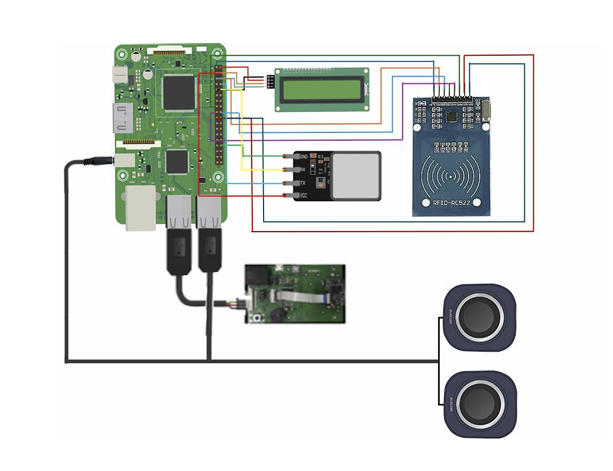

# Raspberry Pi 기반 스마트카트

## 프로젝트 개요
- **기간**: 2024.09 ~ 2024.12 (캡스톤 디자인)
- **목적**: 팀원 모두 처음 다뤄보는 Raspberry Pi 보드를 활용해, 바코드·LCD·스피커·RFID 등 여러 모듈을 통합하고 Firebase로 모바일 앱과 실시간 통신하는 스마트카트 개발
- **역할**: 주변장치(HW) 통합 및 제어 로직 설계, 네트워크·통신 환경 구축

## 사용 기술
- **HW**: Raspberry Pi, 바코드 스캐너, I2C LCD, 스피커, RFID 리더, 지문센서
- **SW**: Python, Firebase Firestore, 네이버 쇼핑 API

## 설계 내용
- 바코드, LCD, 스피커, RFID 등 다수의 주변장치를 하나의 Raspberry Pi 보드에 통합
- 네이버 쇼핑 API를 연동해 상품 정보를 조회하고, Firebase Firestore를 통해 라즈베리파이-앱 간 실시간 통신 구현
- 안정적인 Wi-Fi 연결은 Firebase 통신을 포함한 전체 시스템 동작의 필수 조건이었음

## 문제 해결 과정
개발 중 **라즈베리파이가 부팅 후 Wi-Fi에 자동으로 연결되지 않는 문제**가 반복적으로 발생했습니다.

- **1차 시도**: 일반적인 네트워크 설정 문제로 판단해 `wpa_supplicant.conf` 수정, 국가 설정 변경, 연결 우선순위 지정, 무선랜 카드 추가 등을 시도했으나 해결되지 않았습니다.
- **관점 전환**: 포기하지 않고 동작 조건을 하나씩 비교하던 중, **HDMI로 모니터를 연결했을 때는 Wi-Fi가 정상 연결되지만, HDMI를 제거하면 연결되지 않는다**는 차이를 발견했습니다. 이를 통해 단순한 Wi-Fi 설정 문제가 아니라 부팅 환경과 연관된 문제일 수 있다고 원인 분석 방향을 전환했습니다.
- **해결**: `config.txt`에서 HDMI 출력을 강제로 활성화해 모니터 연결 여부와 무관하게 동일한 부팅 환경을 유지하도록 설정하고, 네트워크 우선순위도 재조정했습니다.

## 결과
- 모니터 연결 여부와 관계없이 Wi-Fi가 자동으로 연결되어, 라즈베리파이-앱 간 Firebase 통신을 안정적으로 유지
- 바코드, LCD, 스피커, RFID를 통합한 스마트카트 프로토타입 완성

## 배운 점
- 익숙한 해결책이 통하지 않을 때는 동작 조건들을 하나씩 비교하며 원인의 범위를 좁히고, 문제를 다른 관점에서 바라보는 것이 중요하다는 것을 배움
